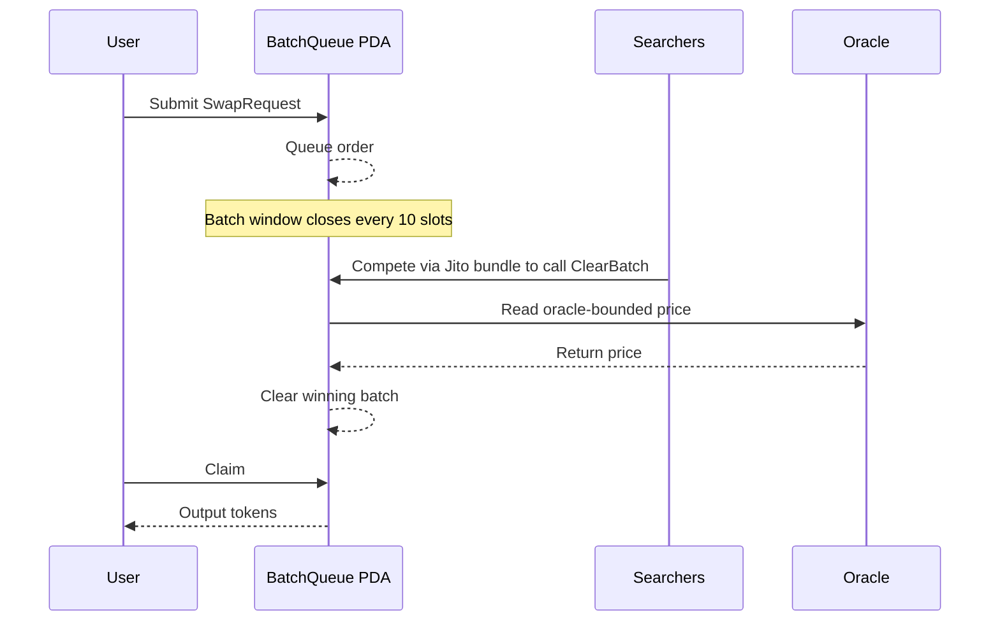

Axis is a permissionless ETF protocol on Solana. This page explains the core concepts.

---

## The Basic Idea

A traditional ETF (Exchange-Traded Fund) is a basket of assets that trades as a single token. Axis brings this primitive on-chain — permissionlessly, on Solana.

Anyone can:

1. Create a basket of SPL tokens with custom weights
2. Deposit liquidity to mint ETF tokens
3. Let others invest by swapping into that ETF token

When someone invests in your ETF, they receive an SPL token representing their proportional share of the underlying basket. They can trade or redeem it at any time.

---

## The Two Roles

**Creator**\
Defines the basket. Chooses tokens, sets weights, names the ETF.

**Investor**\
Swaps SOL or any supported token into an ETF token. Holds a proportional claim on the underlying basket.

<Note>
  In the current Mainnet MVP, creator fees are not enabled. All swap fees go to the protocol.
</Note>

---

## The Rebalancing Problem (and Why It Matters)

Every on-chain index fund before Axis lost value through rebalancing. When prices drift, the pool needs to rebalance — and in a standard AMM, arbitrageurs front-run or back-run every rebalance trade, extracting value from holders.

This loss is called **LVR (Loss-Versus-Rebalancing)**.

Axis addresses LVR through the PFDA mechanism.

---

## The PFDA Mechanism

PFDA stands for **Protocol Fee Discount Auction**.

Instead of processing each swap immediately (as a standard AMM does), Axis batches swap requests over a window of 10 Solana slots (~4 seconds). At the end of each window, the batch is cleared at a single uniform price.

Key properties:

- **No front-running**\
  orders are queued, not executed individually
- **MEV internalization**\
  searchers bid for the right to clear the batch; winning bids flow to the protocol
- **O(1) clearing cost**\
  the `ClearBatch` instruction uses ~38,000 compute units regardless of how many orders are in the batch
- **Oracle-bounded pricing**\
  the clearing price must stay within ±5% of the Switchboard oracle price

<Card title="Deep dive: PFDA Mechanism" icon="circle-info" href="/protocol/pfda">
</Card>

---

## The AMM Design

Axis uses a **G3M (Geometric Mean Market Maker)** as the underlying pool structure, with a target architecture extending to TFMM (Time-Function Market Maker) with dynamic weights. Unlike fixed-weight AMMs (like Uniswap v2), target weights can be updated to track intended exposure over time. The pool design is built into the PFDA mechanism.

<Card title="Deep dive: PFDA Mechanism" icon="circle-info" href="/protocol/pfda">
</Card>

---

## The Swap Flow

---

## Two Environments

Axis runs as two separate products:

<CardGroup cols={2}>
  <Card title="Devnet MVP" icon="flask" href="/getting-started/devnet">
    [axs.pizza](https://axs.pizza) — open test, no real funds
  </Card>

  <Card title="Mainnet MVP" icon="shield" href="/getting-started/mainnet">
    [mainnet.axs.pizza](https://mainnet.axs.pizza) — invite-only, real Solana Mainnet
  </Card>
</CardGroup>