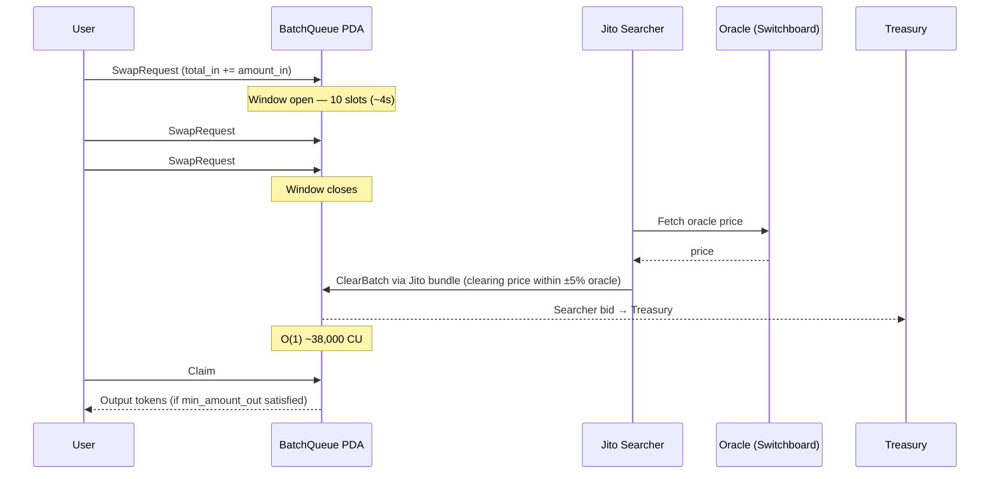
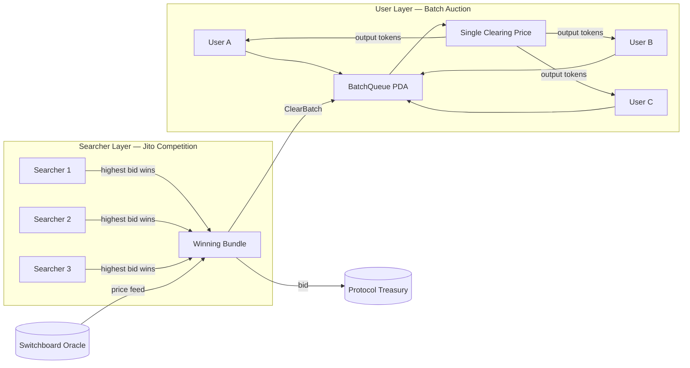

PFDA stands for **Protocol Fee Discount Auction** — a periodic batch auction architecture for processing swaps and rebalancing orders in Axis ETF pools.

The design is adapted from Adams et al. (Uniswap Labs, 2025) and implemented natively on Solana's SVM.

---

## The Problem: LVR

In a standard AMM, every price update creates a window for arbitrageurs:

1. External price moves
2. Arbitrageur sees the AMM is stale
3. Arbitrageur front-runs or back-runs the next user trade
4. Value is extracted from the pool

This extraction is called **LVR (Loss-Versus-Rebalancing)** — formalized by Milionis, Moallemi, Roughgarden, and Zhang (2024).

Every previous on-chain index fund suffered from this. Rebalancing trades leaked value to arbitrageurs on every price movement.

---

## The Pool Design: G3M

Axis uses a **G3M (Geometric Mean Market Maker)** as the underlying pool pricing engine — a generalization of Uniswap's AMM to n tokens with arbitrary weights.

The invariant:

```
∏ x_i^{w_i} = k
```

where `x_i` is the reserve of token i, `w_i` is the target weight (summing to 1), and `k` grows monotonically as fees accumulate.

For a swap of token i → token j:

```
price(i→j) = (x_j / w_j) / (x_i / w_i)
```

Unlike fixed-weight AMMs, Axis's target architecture extends G3M to a **TFMM (Time-Function Market Maker)** where weights can update over time — enabling "winners run" behavior rather than constant sell-the-winner rebalancing. The full TFMM logic is in development; the current Mainnet beta runs G3M.

---

## The PFDA Solution

The PFDA sits on top of the G3M pool and handles all order routing through batch clearing.

Instead of processing swaps immediately (as a standard AMM does), PFDA batches orders over a fixed window and clears them at a single price.

**The key insight:** if all orders in a window get the same price, and that price is bounded by an oracle, no individual order can be front-run or back-run. The extractable MEV collapses to "who gets to clear the batch" — and that right is auctioned, with proceeds flowing to the protocol.

---

## The Four Steps

<Steps>
  <Step title="SwapRequest">
    The user submits a `SwapRequest` transaction. This does not execute immediately. It registers the order in the `BatchQueue` PDA, incrementing counters:

    ```
    total_in += amount_in
    ```

    No price is committed at this step.
  </Step>
  <Step title="Window Closes">
    Every 10 Solana slots (~4 seconds), the batch window closes. No new orders enter the current batch.
  </Step>
  <Step title="ClearBatch (searcher)">
    Jito searchers compete off-chain to submit the `ClearBatch` instruction via Jito bundle. The winning searcher:
    - Calculates the uniform clearing price for the batch
    - Verifies it falls within ±5% of the Switchboard oracle price
    - Pays a bid to the protocol treasury
    - Clears all orders at the single clearing price in O(1) compute (~38,000 CU)

    The cleared results are stored in `ClearedBatchHistory`.
  </Step>
  <Step title="Claim">
    The user calls `Claim`. The contract:
    - Looks up the user's order in the batch history
    - Verifies the clearing price satisfies `min_amount_out` (slippage tolerance)
    - Releases output tokens to the user

    If the clearing price fails the slippage check, the transaction reverts and the user's input is returned.
  </Step>
</Steps>

---



---

## Two Layers of Auction

**User layer (batch auction):** All users in the same batch window get the same clearing price. No one can be targeted individually.

**Searcher layer (Jito competition):** Multiple searchers compete off-chain for the right to call `ClearBatch`. This is MEV — but instead of going to an anonymous extractor, the bid flows to the protocol treasury.

---



---

## O(1) Clearing

The `ClearBatch` instruction reads two numbers — `total_in` and `oracle_price` — and calculates one clearing price. It does not loop over individual orders.

**Compute unit cost: ~38,000 CU, fixed regardless of batch size.**

This means a batch with 1 user and a batch with 10,000 users costs the same to clear.

---

## Oracle Bounding

The clearing price is bounded to ±5% of the Switchboard oracle price at the time of clearing. If the calculated clearing price falls outside this range, the batch cannot be cleared and orders are returned.

This prevents the pool from being drained by a single large order that pushes the price far from fair value.

---

## Drift Detection and Rebalancing

The pool tracks deviation of actual weights from target weights. When any token drifts beyond the threshold, the rebalancing flow is triggered:

```rust
{
  max_drift_bps: u64,
  token_index: u8,
  threshold: u64,       // default 500 bps (5%)
  needs_rebalance: bool
}
```

Rebalancing swaps go through Jupiter V6 via CPI, running within the same transaction as batch clearing.

---

## Current Implementation

Axis runs `pfda-amm-3` on Solana Devnet and Mainnet.

| Program | Devnet ID |
|---|---|
| `pfda-amm-3` | `DbAPmgkrpCCZrpBMv5x1ye6nJUreqY313SuQjZsMyjEf` |

On Mainnet, the same architecture runs with live Jito searcher competition and real Switchboard feeds.

---

## References

- Adams et al., "The Protocol Fee Discount Auction," Uniswap Labs (2025)
- Milionis, Moallemi, Roughgarden, Zhang, "Automated Market Making and Loss-Versus-Rebalancing," arXiv:2208.06046 (2024)
- Kikuta, "A Periodic Batch Auction Architecture for LVR Mitigation on Solana," Axis (2026)
- Willetts and Harrington, "Pools as Portfolios," arXiv:2602.22069 (2026)
- Willetts and Harrington, "Riemannian Geometry of Optimal Rebalancing," arXiv:2603.05326 (2026)
- Willetts and Harrington, "Multiblock MEV in Dynamic AMMs," arXiv:2404.15489 (2024)

<Card title="Full papers list" icon="book" href="/research/papers" />
